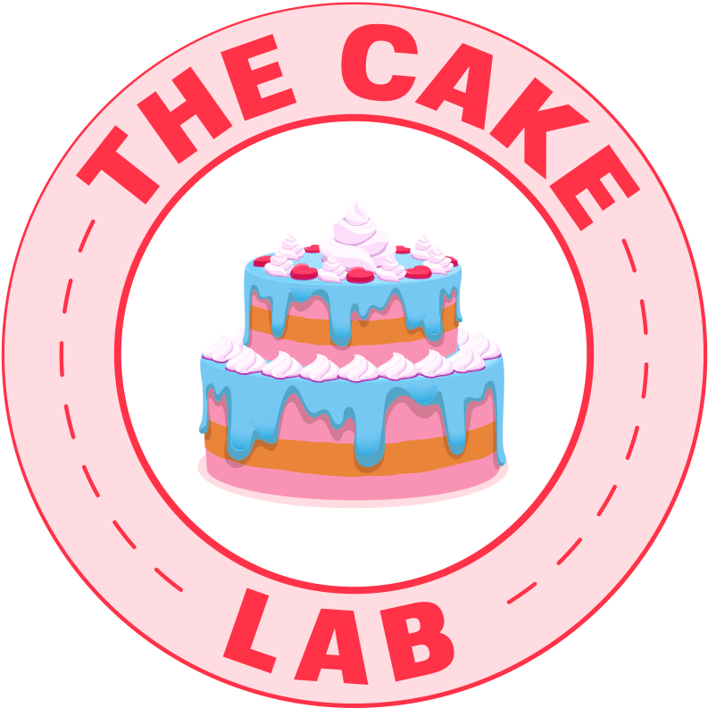

<figure markdown>
  { width="200" }
</figure>

# Overview 

Hello, my name is [Tian Guo](https://tianguo.info/) I am a computer science professor at WPI. 
This site tracks academic research on microservice, as well as my personal reading notes. 

## Why This Site? 

A large part of my job is research, which roughly divides into keeping up with SToA, advising students, hands-on projects, and writing grant proposals. 

As an early 2023 new year resolution, I want to know more about microservice.
I love reading and writing, so what would be a better way to keep me motivated.

## Relevant Conferences 

Here are the list of conferences, not in any particular order, which I find each paper. 

- EuroSys
- SoCC 
- ICDCS 
