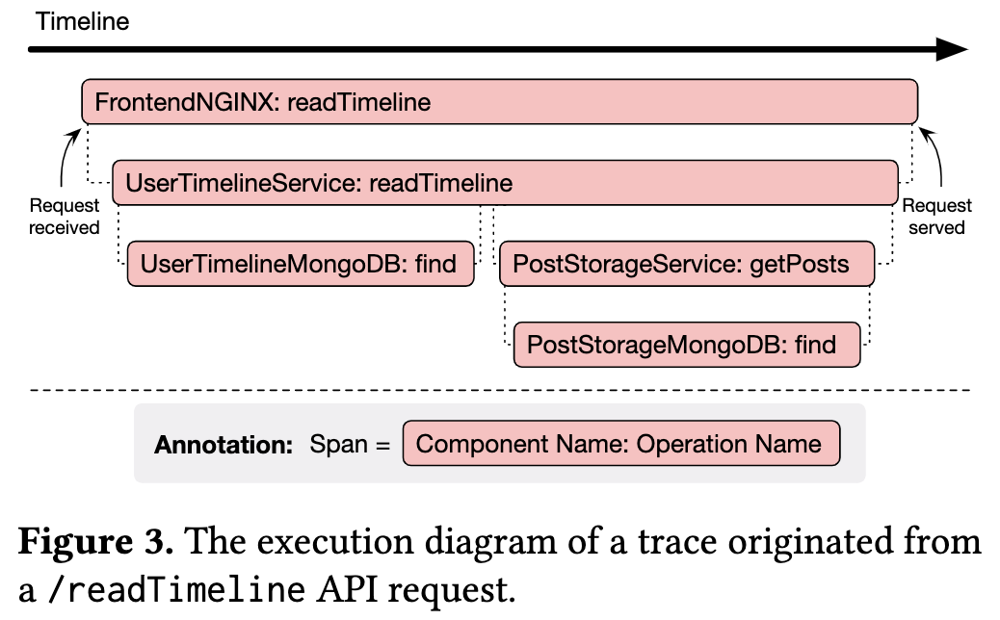
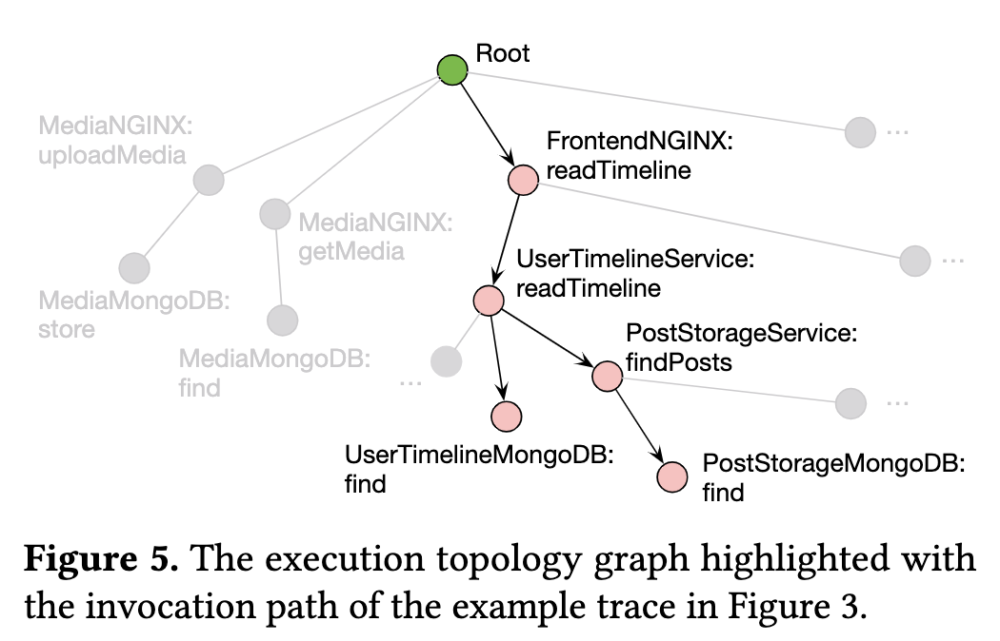
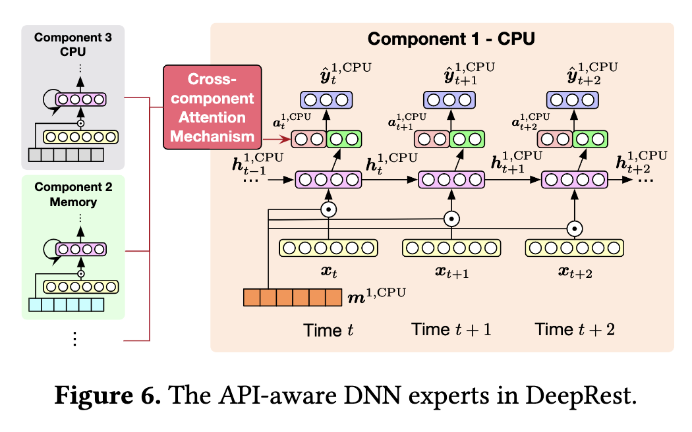
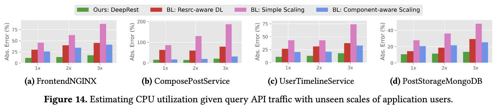

# DeepRest: Deep Resource Estimation for Interactive Microservices

## Overview 

<!-- title, authors, venue -->
Chow, K.-H. et al. 2022. DeepRest: deep resource estimation for interactive microservices. Proceedings of the Seventeenth European Conference on Computer Systems (New York, NY, USA, Mar. 2022), 181–198.

### How Many Passes? 

<!-- just a quick indication of my understanding of the paper -->

:white_check_mark: 

<!-- personal ratings, max: five stars-->

### My Ratings 

- novelty: :star: :star: :star:
- readability: :star: :star: :star: 
- reproducability: :star: :star: 
- practicability: unclear 

## High-Level Ideas 

DeepRest models the resource utilization for each API endpoint. 

For the DeepRest feature engineering component, it takes distributed traces as input (see Figure 3 for an example), and outputs an execution topology graph (see Figure 5 for an example). Here, FrontendNGNIX is considered a *component*, and readTimeline is considered a *operation name*. 

<figure markdown>
  { width="500" }
  { width="500" }
</figure>

The paper claims that its feature engineering method is more privacy-conserving compared to other NLP-based work that mines the information from the log, such as this work [^1]. One of the reasons listed is that DeepRest only requires *component* and *operation names*, and also hashes these strings.
 
The authors made the observations that the resource utilization can be inferred from the innovation path, which can be identified via the DeepRest's feature engineering step. 

[^1]: 
    Zhou, G. and Maas, M. 2021. Learning on distributed traces for data center storage systems. Proceedings of Machine Learning and Systems. 3, (Mar. 2021), 350–364.

Once DeepRest obtains the feature vectors, it estimates the resource utilization time-series for all component in a specific resource dimension. That is, DeepRest models different resource utilization (e.g., disk or CPU) using a dedicate DNN model. These DNN models are referred to as *DNN experts* in this paper. 

The multi-expert resource estimator has the following three key design elements: 

- Because different API endpoints can lead to different invocation paths, DeepRest uses a **learnable weight vector** to mask the input feature and then automatically associate attributes API invocation to corresopnding resource utilization. 
- To account for the residual requests' impact on the current resource utilization, DeepRest uses a recurrent structure called *Gated Recurrent Units (GRUs)*. The use of recurrent architecture also allows DeepRest to process variable input lengths; e.g., how much workload history to encode. 
- To correlate the resource utlization of different components, DeepRest uses the attention mechanism to allow different DNN experts, which are in charge of one resource prediction, to communicate with each other. 

The following figure shows an example of one such DNN expert, for estimating the *CPU resource* for the *Component 1*. Assuming N components and each component has three resource dimensions (CPU, memory, and disk), DeepRest will end up with **3N** experts. 

- I am curious about the overhead, both in terms of training those experts and using these experts. How does the overhead compare to the resource provisioning savings from using DeepRest?

<figure markdown>
  { width="500" }
</figure>

## Key Novelties 

The main novelty is probably the API-based resource estimation model which nicely uses DL model design to solve system problem. 
Note that DeepRest alone can't deliver guranteed end-user performance such as end-to-end latency. DeepRest has to be used in conjunction with auto-scaling policies, such as [^2], to adjust resource allocation. 

The paper presnets two use cases, *resource allocation* and *application sanity check*, that can benefit from more accurate resource utilization provided by DeepRest. It is an interesting addons but I wish the paper has provided some more details on how to adjust reosurces and the impact on user-facing metrics like latency. The current analyses and comparions are still about the resource estimation accuracy, e.g., Figure 14. 

<figure markdown>
  { width="800" }
</figure>

Without showing actual provisioning costs and performance metrics, I am not sure how to interpret the presented results---for example, Figure 14 only shows that DeepRest has better predictions of how many resources are needed. However, questions such as whether the predicted resource gaps between different approaches are substaintial to save container resources or to impact end-user performances remain unclear. 

## Evaluation Highlights 

Like many microservice papers, this paper uses the microservice applications from the DeathStarBench. 
To emulate the real-world workload, the authors used the graph data for Facebook for the *Social Netowrk* application and generated synthetic data for the *Hotel Reservation* application. Further, the authors used Locust, a load testing tool, to issue requests to the microservices. 

It is unclear what the container cluster used for microservice deployment looks like. The paper mentions: 

> We deploy all microservices in separate Docker containers orchestrated by Kubernetes

> We collect seven days of data for application learning and train DeepRest ... 

Since the resource utilization data used to train DeepRest is container-dependent, I am curious the impact of different deployments, e.g., homogenous or heterogenous container resources.

## Some Closing Thoughts

I quite like the API-driven resource estimation approach for microservice, and I think the paper has many clever points. 

What happens if for the same API endpoint, we start to observe different execution graphs depend on factors such as time and location? Will DeepRest still work well?

DeepRest takes an interesting stance by decomposing the resource provisioning for microservices to each API end point. A lingering question is how well API-based resource provisioning compared to call graph-based (aggregated API endpoint executions) resource provisioning.

It would be interesting to see how DeepRest compares to the power of prediction paper [^2] in **resource estimation**. (*Note: DeepRest was accepted to EuroSys 2022 which took place on April 5-8 2022, while SoCC 2022 submission deadline was June 17, 2022*.) 

[^2]: Luo, S. et al. 2022. The power of prediction: microservice auto scaling via workload learning. Proceedings of the 13th Symposium on Cloud Computing (New York, NY, USA, Nov. 2022), 355–369.