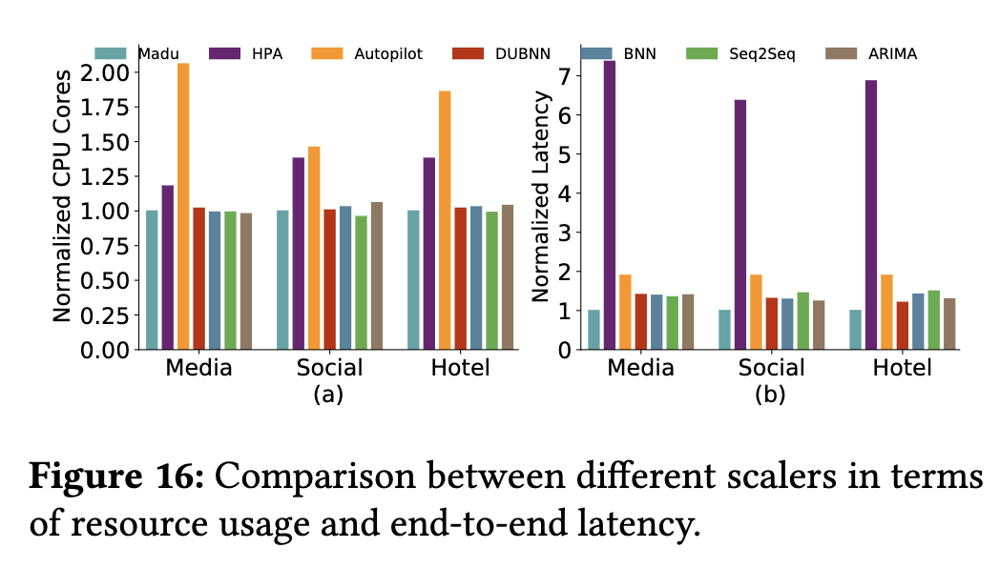
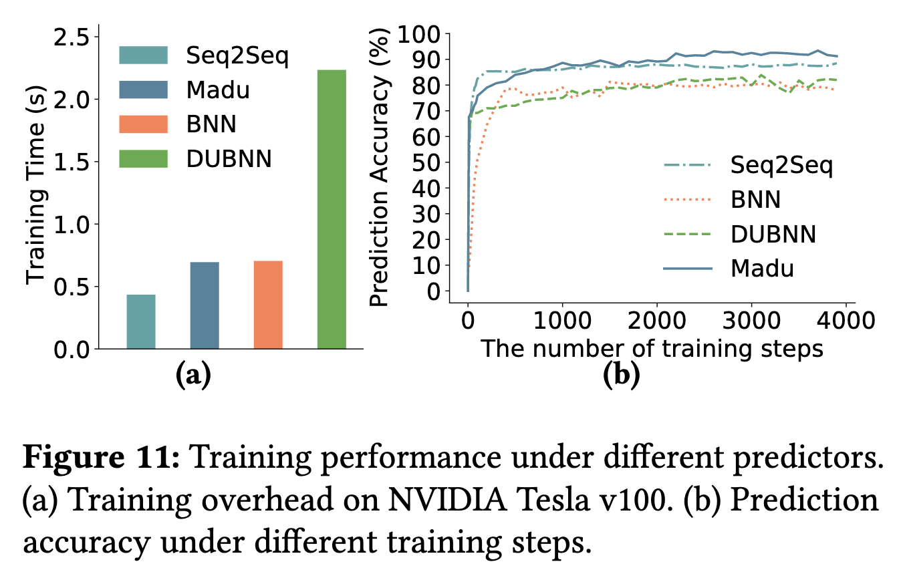
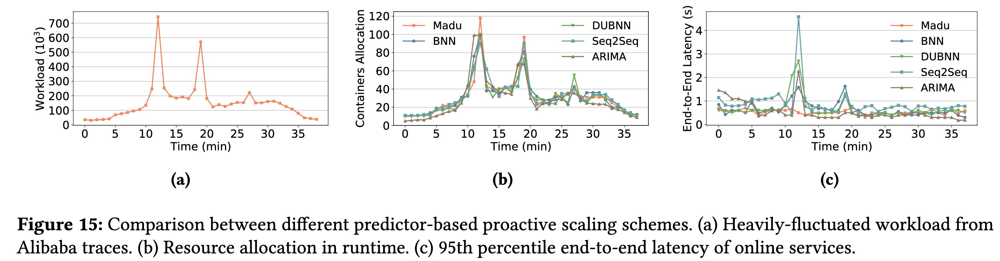

# The power of prediction: microservice auto scaling via workload learning

## Overview 

<!-- title, authors, venue -->
Luo, S. et al. 2022. The power of prediction: microservice auto scaling via workload learning. Proceedings of the 13th Symposium on Cloud Computing (New York, NY, USA, Nov. 2022), 355–369.

### How Many Passes? 

<!-- just a quick indication of my understanding of the paper -->

:white_check_mark: :white_check_mark:

<!-- personal ratings, max: five stars-->

### My Ratings 

- novelty: :star:
- readability: :star: :star: :star: 
- reproducability: :star:
- practicability: :star: :star: :star: :star: 

## High-Level Ideas 

This paper targets at the container-level resource management for microservice. One of the key arguements the paper makes is that:

> microservice workload per container is strongly correlated with the container’s OS-level metrics (such as CPU and memory utilization), more than with application-level metrics (i.e., microservice response time). 

The paper uses this argument to justify the design of "container-based auto-scaler", which adjusts the resource configuration of each container **in isolation**. My current reactions are two-fold: 

- If we scale microservice resources without considering *call graph depdency*, why do we need another auto-scaler for the microservice? How well do exisiting auto-scalers (that are not specifically designed for microservice) work? These questions are partially answered in the comparison to Google's Autopilot.
 
> Autopilot is a **reactive scaler** that uses a moving window to collect resource usage statistics in a most recent period, and scales resources based on these statistics, such as the average CPU and memory utilization.

<figure markdown>
  { width="500" }
</figure>

The above figure shows that Madu (the auto-scaler proposed by this paper) uses only about 50% fewer CPU cores, while reducing the average latency by 90%, compared to Autopilot. 

I am not surprised that proactive auto-scalers (Madu) outperform reactive auto-scalers (Autopilot). Though I am curious about the following few aspects:

- The paper only shows the comparison in terms of "Normalized CPU Cores", what about other resource dimensions? Is this because the "two representative workload traces" are CPU-bound? 

    > Since Alibaba clusters have deployed thousands of online services, far more than Death- StarBench, we selected only two representative workload traces.

- How much of the latency performance difference is due to the *provisioning delay* of reactive autoscaler, and how much is due to the resource estimation algorithms? (See Eq (11) for Madu's formulation.)
- How does Madu compare to other proactive auto-scalers? This paper seems to equate "proactive auto-scalers" to workload prediction algorithm plus the online container scaling scheme (Section 4.3). Based on Figure 11, Madu's call per minute prediction accuracy is very close to that of Seq2Seq. I am a bit surprised to see the reported improvement. 
  > As illustrated in Fig. 15(c), Madu manages to reduce end-to-end latency by 35% on overage and 5.9× at peak demands, compared to the other four scalers.

<figure markdown>
  { width="500" }
</figure>

The very slight workload prediction accuracy actually made a huge difference, as reported, under the heavily-flucated workload. So likely, the benefit is magnified by the many resource estimation "triggers".
<figure markdown>
  { width="600" }
</figure>

- Last but not the least, how should we understand the resource consumption and performance trade-off? In some cases, Madu launched more containers and had lower latency compared to Seq2Seq. That results are expected, and I am not sure they demonstrate Madu has better performance.  
  > Madu uses 3% more resources than the other four scalers due to underestimating peak demands. 

## Key Novelties 

The first one is probably the microservice workload predictor, built on top of the basic Seq2Seq model. (Sec 4.1) In particular, the paper describes "a stochastic attention mechanism" to model the workload uncertainty. The resulting model architecture is described in Figure 7 (not open sourced).

## Evaluation Highlights 

- The evaluation of the the workload predictor is based on the 1K microservices from the Alibaba's production clusters, which is open sourced and available [here](https://github.com/alibaba/clusterdata/tree/master/cluster-trace- microservices-v2022).

## A Closing Thought 

I still feel using *container-based provisioning* for microservice misses the key opportunity presented by dynamic call graph, and can easily lead to overprovisioning (maybe underprovisioning). 